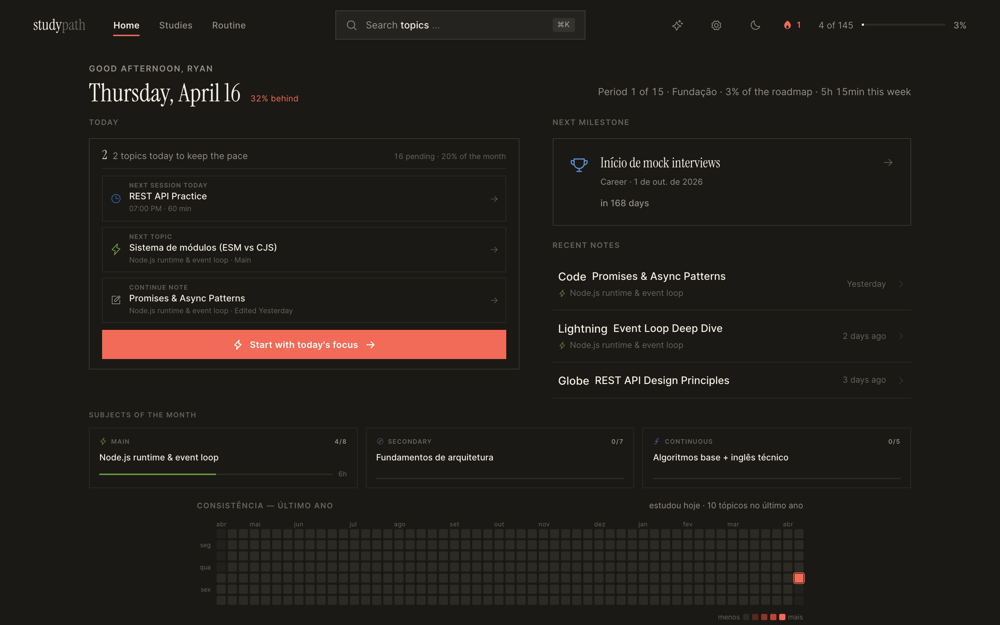
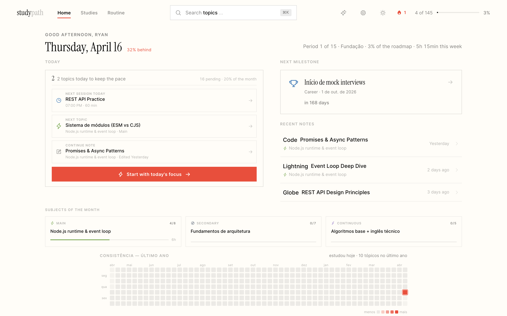
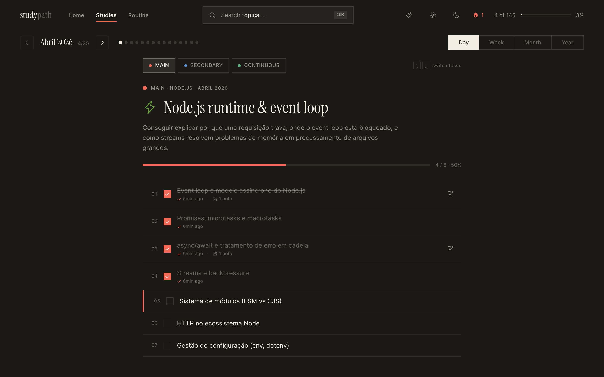
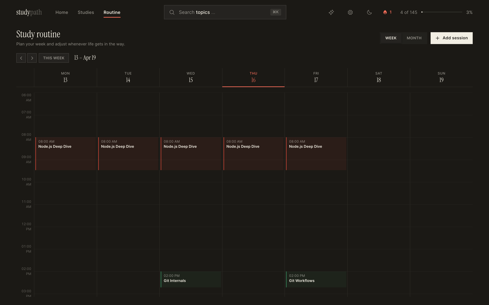

<p align="center">
  
</p>

<h1 align="center">StudyPath</h1>

<p align="center">
  <strong>A desktop companion for long-term, structured learning.</strong><br/>
  Built for a 15-month technical study roadmap &mdash; track progress, take rich notes, build habits.
</p>

<p align="center">
  
  
  
</p>

<p align="center">
  <a href="https://github.com/ryan-mf-eloy/studypath/releases/latest">
    
  </a>
  &nbsp;
  <a href="https://github.com/ryan-mf-eloy/studypath/releases/latest">
    
  </a>
</p>

<br/>

<p align="center">
  
</p>

<br/>

## Overview

StudyPath is a native desktop app that turns a multi-month study plan into a daily practice. It combines a structured roadmap, a rich note editor, a weekly routine calendar, and session tracking into a single, offline-first experience.

Everything runs locally. Your data lives in a SQLite database on your machine. No cloud, no accounts, no subscriptions.

<br/>

<p align="center">
  
</p>
<p align="center"><sub>Light mode</sub></p>

<br/>

## Features

### Dashboard

The home screen shows what matters today: the next topic to study, your most recent notes, pacing against the roadmap, and the next milestone. A consistency heatmap visualizes your study habits over the past year.

### Study Tracker

Browse topics by day, week, month, or year. Each focus area (Main, Secondary, Continuous) has its own color and progress bar. Check off topics as you complete them. Start a timed study session with one click.

<p align="center">
  
</p>

### Routine Calendar

Plan recurring study blocks on a weekly grid. Slots are color-coded by focus area and can be skipped or rescheduled individually without changing the base pattern.

<p align="center">
  
</p>

### Rich Notes

A block-based editor (powered by BlockNote) with syntax-highlighted code blocks, link previews, embedded media, file uploads, and custom checkboxes. Notes are linked to roadmap topics and searchable from anywhere.

### Command Palette

Press `Cmd+K` to search across topics, notes, and focuses. Navigate the entire app without touching the mouse.

### Spaced Repetition

Topics enter a review queue after completion. The SRS system schedules reviews at increasing intervals to reinforce long-term retention.

### Study Timer

A persistent timer pill tracks active study sessions. Planned duration, focus area, and topic are pre-filled from the routine calendar or manual selection.

### Dark & Light Themes

Full dark and light mode support. The theme follows the system preference or can be set manually.

### Internationalization

The interface ships in Brazilian Portuguese (primary), English, Spanish, French, and German.

<br/>

## Architecture

StudyPath runs as a single Electron process containing both the renderer (React) and the server (Hono + SQLite). There is no external backend.

```
┌─────────────────────────────────────────────────┐
│                  Electron Main                  │
│                                                 │
│   ┌──────────────┐    ┌──────────────────────┐  │
│   │  Hono Server │    │   BrowserWindow      │  │
│   │              │◄──►│                      │  │
│   │  /api/*      │    │   React 19 + Vite    │  │
│   │  SQLite (WAL)│    │   Zustand stores     │  │
│   │  127.0.0.1:? │    │   BlockNote editor   │  │
│   └──────────────┘    └──────────────────────┘  │
└─────────────────────────────────────────────────┘
```

The server binds to a random ephemeral port on `127.0.0.1`. The renderer loads from the same origin — no CORS, no `file://` protocol quirks.

### Tech Stack

| Layer | Technology |
|---|---|
| Desktop shell | Electron 41, electron-vite, electron-builder |
| Frontend | React 19, TypeScript, Tailwind CSS v4 |
| State | Zustand 5 with optimistic write-through |
| Editor | BlockNote 0.47 (ProseMirror), Shiki syntax highlighting |
| Backend | Hono 4, @hono/node-server |
| Database | SQLite via better-sqlite3 (WAL mode) |
| Icons | Phosphor Icons |
| i18n | i18next, react-i18next |
| DnD | @dnd-kit/core, sortable, modifiers |

### Data Flow

1. **Hydration** — On mount, the client fetches the full state bundle from `GET /api/state`
2. **Optimistic writes** — Zustand stores update immediately, then enqueue a write to the server
3. **Retry queue** — Failed writes retry automatically until the server is reachable
4. **Server-computed metrics** — Aggregated stats (pace, streak, time breakdown) are computed in SQL

<br/>

## Getting Started

### Prerequisites

- **Node.js** 20+
- **npm** 10+

### Install

```bash
git clone <repo-url>
cd studypath
npm install --legacy-peer-deps
```

### Development

**Browser mode** (server + Vite HMR, no Electron):

```bash
npm run dev
```

Open [http://localhost:5173](http://localhost:5173). The API runs on port 3001.

**Electron mode** (full desktop app with HMR):

```bash
npm run rebuild:electron
npm run dev:electron
```

### Build

```bash
# macOS (Universal: x64 + arm64)
npm run pack:mac

# Windows (x64 NSIS installer)
npm run pack:win

# Linux (AppImage + .deb)
npm run pack:linux
```

Artifacts are written to `release/`.

### Smoke Tests

```bash
npm run smoke:api          # API endpoint smoke test
```

<br/>

## Project Structure

```
studypath/
├── electron/              # Electron main process
│   └── main.ts            # Window, menu, tray, embedded server
├── server/                # Hono backend
│   ├── index.ts           # Server bootstrap + static serving
│   ├── db.ts              # SQLite connection (lazy proxy)
│   ├── schema.ts          # DDL (inline, bundleable)
│   └── routes/            # REST endpoints
│       ├── state.ts       # Full-state hydration bundle
│       ├── progress.ts    # Topic check-off
│       ├── sessions.ts    # Study session CRUD
│       ├── notes.ts       # Notes CRUD
│       ├── routines.ts    # Routine slots + overrides
│       ├── metrics.ts     # Aggregated metrics (SQL)
│       ├── roadmap.ts     # Roadmap CRUD + seed
│       └── ...            # reviews, subtopics, milestones, etc.
├── src/
│   ├── main.tsx           # React entry point
│   ├── App.tsx            # Router + layout
│   ├── pages/             # Top-level page components
│   ├── components/
│   │   ├── layout/        # TopBar, PageNav, ThemeToggle
│   │   ├── overview/      # Dashboard widgets
│   │   ├── views/         # Day, Week, Month, Year, Routine views
│   │   ├── panels/        # Slide-over panels (notes, routine detail)
│   │   ├── editor/        # BlockNote integration + custom blocks
│   │   ├── settings/      # Structure editor, milestones, data mgmt
│   │   └── ui/            # Reusable primitives
│   ├── store/             # Zustand stores (15 stores)
│   ├── lib/               # Pure utilities, API client, sync engine
│   ├── styles/            # tokens.css, globals.css, editor theme
│   ├── i18n/              # Locale JSONs (pt-BR, en, es, fr, de)
│   └── data/              # Static roadmap seed data
├── build/                 # App icons (icns, ico, png, tray)
├── scripts/               # Smoke tests, icon generation
└── docs/                  # Design references + screenshots
```

<br/>

## Scripts Reference

| Command | Description |
|---|---|
| `npm run dev` | Browser dev mode (Vite + server) |
| `npm run dev:electron` | Electron dev mode with HMR |
| `npm run build` | Build renderer (TypeScript + Vite) |
| `npm run pack:mac` | Package macOS DMG (x64 + arm64) |
| `npm run pack:win` | Package Windows NSIS installer |
| `npm run pack:linux` | Package AppImage + .deb |
| `npm run smoke:api` | Run API endpoint smoke tests |
| `npm run rebuild:node` | Rebuild native modules for Node.js |
| `npm run rebuild:electron` | Rebuild native modules for Electron |
| `npm run icon:generate` | Generate all app icon formats |
| `npm run lint` | Run ESLint |

<br/>

## Database

The database is a single SQLite file stored in the platform's user data directory:

| Platform | Path |
|---|---|
| macOS | `~/Library/Application Support/StudyPath/studypath.db` |
| Windows | `%APPDATA%/StudyPath/studypath.db` |
| Linux | `~/.config/StudyPath/studypath.db` |

In development (browser mode), the database is created at `./data/studypath.db`.

SQLite is configured with **WAL mode** for concurrent read performance. The schema is applied on startup via `runSchema()` — all DDL statements use `CREATE TABLE IF NOT EXISTS` for idempotency.

### Backup & Restore

The settings menu provides JSON export and import of all application data. The backup file includes progress, sessions, notes, routines, and roadmap configuration.

<br/>

## Design

The interface follows an editorial design language: warm cream backgrounds, serif headings (Instrument Serif), clean sans-serif body text (Inter), and restrained use of color.

Three accent colors map to focus types:

| Focus | Color | Use |
|---|---|---|
| Main | `#E84F3C` (coral) | Primary study area |
| Secondary | `#2B6CB0` (blue) | Supporting topics |
| Continuous | `#3D9E6B` (green) | Ongoing practice |

All colors are defined as CSS custom properties in `src/styles/tokens.css`. No hardcoded hex values in components.

<br/>

## License

[MIT](LICENSE) &copy; Ryan Eloy

---

<p align="center">
  <sub>Built with Electron, React, Hono, and SQLite.</sub>
</p>
